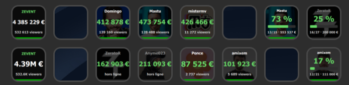

# ZEvent pour Stream Deck

[](https://github.com/quentinperou/streamdeck-zevent/actions/workflows/build.yml)
[](https://github.com/quentinperou/streamdeck-zevent/releases)
[](LICENSE)

Affiche les cagnottes du [ZEvent](https://zevent.fr/) sur les touches d'un Stream Deck, et ouvre la
chaîne Twitch du streamer d'un simple appui.

BOURREZ LES DONS !!



## Installation

Récupérez le fichier `.streamDeckPlugin` de la
[dernière release](https://github.com/quentinperou/streamdeck-zevent/releases)
et double-cliquez dessus : Stream Deck se charge du reste. Les actions
apparaissent ensuite dans la catégorie **ZEvent**.

## Actions

| Action | Touche | Appui |
| --- | --- | --- |
| **Cagnotte streamer** | Pseudo, cagnotte, viewers, avatar en fond | Ouvre `twitch.tv/<pseudo>` (ou la page de don) |
| **Cagnotte globale** | Total du ZEvent et viewers cumulés | Ouvre la page de don (ou `zevent.fr`) |
| **Palier de dons** | Avancement vers un palier, en barre de progression | Ouvre `twitch.tv/<pseudo>` (ou la page de don) |

Le bandeau vert en bas de touche signale un stream en direct ; il s'éteint
lorsque le streamer est hors ligne. Une pastille ambre apparaît si la donnée
affichée a plus de trois minutes.

### Format des chiffres

Chaque action propose deux écritures, montants et viewers compris :

| | Cagnotte | Viewers |
| --- | --- | --- |
| **Complets** (défaut) | `4 063 113 €` | `315 036 viewers` |
| **Abrégés** | `4.06M €` | `315K viewers` |

Deux décimales sous 10, une au-delà — `1.25M` d'un côté, `800.8K` de l'autre —
et les zéros inutiles disparaissent (`1.00M` s'écrit `1M`). Une touche fait
72 pixels : moins de caractères, c'est une police plus grande et un montant
lisible d'un coup d'œil, au prix de la précision.

### Paliers de dons

L'action **Palier de dons** montre où en est un streamer sur l'un de ses
paliers : pourcentage, barre de progression, rang et montant visé. Le Property
Inspector propose soit **le prochain palier à atteindre** — la touche avance
alors toute seule d'un palier au suivant — soit un palier précis choisi dans la
liste, les paliers déjà tombés étant marqués d'une coche.

L'avancement se mesure **depuis le palier précédent**, pas depuis le premier
euro : à 40 000 € pour un palier à 50 000 € qui suit celui de 40 000 €, la
barre affiche 0 % et non 80 %. C'est l'effort restant qui intéresse.

### Deux sources de paliers

Les paliers viennent au choix de l'**API officielle du ZEvent** ou d'**InGDoc**
([evenmorestats.fr](https://zevent.gdoc.fr/donation_goals/)), qui les publie
plus complètement : sur 60 streamers observés, 8 % sont annoncés sans aucun
palier par l'officiel alors qu'ils en ont une quinzaine — Mastu en a 15,
l'API du ZEvent en renvoie 0.

| Réglage | Comportement |
| --- | --- |
| **Auto** *(défaut)* | InGDoc, et repli sur l'officiel dès qu'il ne répond pas |
| **InGDoc** | InGDoc seul — la touche signale l'indisponibilité plutôt que de basculer en douce |
| **ZEvent** | l'API officielle seule |

InGDoc permet en prime d'annoncer, dans le menu déroulant, **le nombre de
paliers de chaque streamer** — un seul appel couvre les 338 participants.
L'API officielle ne les expose que fiche par fiche : il en faudrait 338, donc
l'annotation disparaît quand on impose cette source.

Tous les participants n'en configurent pas — la touche le dit alors clairement
plutôt que d'afficher une barre vide.

## Couleurs

La palette est relevée sur zevent.fr, pas approximée : vert **`#00BD00`** en
accent (celui de la navigation et des pastilles « en direct » du site), noirs
neutres `#0B0B0B` / `#242424` en fond. Le site réserve le blanc à ses grands
compteurs et le vert aux montants de sa liste de streamers — les touches
reprennent cette répartition : cagnotte d'un streamer en vert, total du ZEvent
en blanc sous un intitulé vert.

Le texte, lui, utilise **`#66D766`**, autre valeur de la même palette : à
72 pixels, sur un avatar assombri, le vert de marque perd trop de lisibilité en
petits caractères. Le bandeau « en direct », qui est un aplat, garde `#00BD00`.

L'incrustation sombre posée sur l'avatar est calibrée pour que le vert reste
lisible même sur un portrait clair ou très saturé.

## Property Inspector

Le choix du streamer se fait par **barre de recherche** (insensible à la casse
et aux accents) couplée à un **menu déroulant** listant les 300+ participants
avec leur cagnotte et leur statut. La liste se trie par cagnotte, nom, viewers
ou « en direct d'abord », et la sélection courante reste toujours proposée même
quand la recherche l'exclut.

Sur l'action **Palier de dons**, ce même menu annonce le nombre de paliers de
chaque streamer — `🟢 Mastu — 15 paliers` —, de quoi choisir sans ouvrir chaque
fiche.

## Source des données

Les cagnottes viennent de l'API publique du ZEvent, `https://zevent.fr/api/` —
celle qu'utilise le site lui-même. Elle n'émet aucun en-tête CORS : un Property
Inspector, qui est une page web, ne peut pas l'appeler. C'est donc le plugin
Node qui interroge le ZEvent et pousse le catalogue vers l'interface.

Une seule requête sortante alimente toutes les touches, une fois par minute et
seulement tant qu'une touche du plugin est visible. La réponse pèse 157 ko — la
liste complète des participants, dont une touche n'utilise qu'une ligne : c'est
ce poids qui fixe la cadence, pas la charge serveur, le ZEvent servant cette
route depuis un cache Cloudflare. Une minute représente environ 9 Mo par heure,
contre 28 Mo si l'on interrogeait l'API toutes les 20 secondes.

Aucun appel ne part à moins de 15 secondes du précédent, bouton *Rafraîchir*
compris : c'est la durée de validité que le ZEvent déclare lui-même
(`cache-control: max-age=15`), en deçà on retéléchargerait à l'identique une
réponse déjà servie.

En cas de panne, le dernier état connu reste affiché et les tentatives
s'espacent progressivement (jusqu'à 5 minutes). Les avatars sont récupérés en
70×70 — la variante que Twitch expose déjà — et gardés en mémoire.

Les **paliers** n'y figurent pas. Deux routes les portent, selon la source
choisie :

| Route | Contenu | Poids |
| --- | --- | --- |
| `api.zevent.fr/streamer/<id>` | paliers d'un streamer, chez l'officiel | ~2 ko |
| `api.evenmorestats.fr/events` | éditions, pour trouver l'année en cours par ses dates | ~3 ko |
| `…/events/<id>/donation_goals/overview` | décompte des paliers des 338, en un appel | ~244 ko |
| `…/participations/<pid>/donation_goals` | paliers d'un streamer, chez InGDoc | ~3 ko |

Dans les deux cas, seuls les streamers réellement posés sur une touche
« palier » sont interrogés, jamais les 338. L'édition en cours se déduit des
dates plutôt que d'être codée en dur : le plugin suivra les prochaines sans
modification.

InGDoc est un service communautaire, sans en-tête de cache ni limite de débit
annoncée. Il est sollicité avec la même retenue que le ZEvent, et le mode
« auto » retombe sur l'officiel s'il ne répond pas.

## Développement

```bash
npm install
npm run icons      # régénère les PNG depuis les tracés SVG
npm run build      # bundle src/ vers fr.quentinperou.zevent.sdPlugin/bin/plugin.js
npm run link       # crée le lien symbolique vers le dossier Plugins de Stream Deck
```

Ensuite, `npm run watch` reconstruit et redémarre le plugin à chaque
modification.

`npm run preview` interroge le vrai ZEvent et écrit les visuels de touche en SVG
dans `.preview/` : de quoi itérer sur le rendu sans repasser par Stream Deck.

`npm run check` vérifie que le dossier `.sdPlugin` se tient : point d'entrée
présent, icônes déclarées par le manifest réellement sur le disque (variantes
`@2x` comprises), Property Inspectors accessibles. Stream Deck ne signale ces
chemins qu'à l'installation — ce contrôle les fait remonter au build.

`npm run pack` produit le `.streamDeckPlugin` distribuable.

### Versions

La version vit dans `package.json`. `npm version patch` la propage
automatiquement au `Version` du manifest — que Stream Deck attend en quatre
segments — et au badge du README, via `scripts/sync-version.mjs`. La CI refuse
toute divergence (`npm run sync-version -- --check`).

### Publication

Un tag `v*` poussé sur le dépôt déclenche l'empaquetage et crée la release
GitHub avec le `.streamDeckPlugin` en pièce jointe.

> `Nodejs.Debug` est **absent** du manifest, et doit le rester : le port de
> débogage n'a rien à faire chez les utilisateurs, et le job de publication
> refuse un tag tant que le champ figure. Ajoutez-le localement — avec la valeur
> `enabled` — le temps d'un débogage, sans le committer. N'écrivez jamais
> `disabled` : Stream Deck passe cette valeur à Node en argument de ligne de
> commande et le plugin ne démarre plus.

## Contribuer

Bugs, idées et pull requests sont les bienvenus — voir
[CONTRIBUTING.md](CONTRIBUTING.md), qui détaille la mise en route et les
quelques contraintes du plugin qui ne se devinent pas à la lecture du code.

## Licence

[MIT](LICENSE) — faites-en ce que vous voulez, en gardant la mention de
copyright.

## Crédits

- **[QuentinPerou](https://github.com/quentinperou)** — conception, développement
- **[Claude Code](https://claude.com/claude-code)** (Anthropic) — développement assisté

Les données proviennent de l'[API publique du ZEvent](https://zevent.fr/api/).
Merci à l'équipe du ZEvent de l'exposer ouvertement, et aux streamers qui
remplissent ces cagnottes.

Ce plugin est un projet indépendant : il n'est ni affilié, ni approuvé, ni
soutenu par le ZEvent, Twitch ou Elgato.
